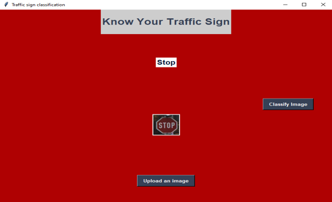
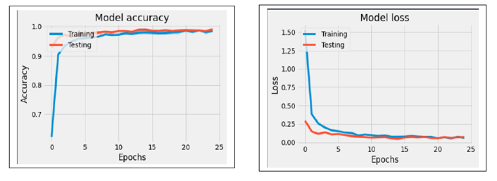

# Detection and Recognition Traffic Signs using Deep Learning

In this project, I used Anaconda, Python, and TensorFlow to classify and recognize traffic signs.

### Motivation ###

The motivation of this project is to better understand the personal interests of object detection and academic research. The goal is to lay the foundation for Road Sign Detection (RSD) and optionally add more objects or functions to it. The ultimate goal is to provide usable object detection for the automotive industry.

### Problem Statement and Goal of the Project ###

**Dataset used here is: [German Traffic Sign Dataset](http://benchmark.ini.rub.de/?section=gtsrb&subsection=dataset) - multi-class classification.
This dataset has more than 50,000 images of 43 classes.**

**98.74% testing accuracy**

Traffic Sign Detection (TSD) is a high-relevance computer vision problem and is the basis for a lot of applications in industry such as Automotive etc. Traffic signs can provide a wide range of variations between classes in terms of color, shape, and the presence of pictograms or text. This project will develop a deep learning algorithm that will train on German Traffic Sign images and then classify the unlabeled traffic signs. The deep learning model will be built using TensorFlow and we will also understand various ways to preprocess images using OpenCV and also use a cloud GPU service provider.

### Use Instructions ###

1. Clone or fork this repository.
2. Launch the Jupyter notebook: `jupyter notebook Traffic_Signs_Recognition.ipynb`
3. Download locally the dataset [German Traffic Sign Dataset](https://www.kaggle.com/meowmeowmeowmeowmeow/gtsrb-german-traffic-sign) 
4. Execute the code cells you are interested in. Note that cells may depend on previous cells and/or require the dataset linked below. The notebook explains clearly what each code cell does.

### Breakdown of this Project:
 - Load The Data
 - Dataset Summary & Exploration
 - Data Preprocessing
    - Shuffling
    - Grayscaling
    - Local Histogram Equalization
    - Normalization
 - Build the architecture of the model
    - LeNet-5
 - Model Training and Evaluation
 - Testing the Model Using the Test Set.
 - Testing the Model on New Images.

### Environment:
    - Anaconda
    - Any OS
    - Python 3.X
    - Numpy
    - OpenCV
    - Matplotlib
    - TensorFlow 0.1X (GPU support)
   
 ### Testing the Model on New Images ###
    
 In this step, we will use the model to predict traffic signs with random images of German Traffic Signs
 For instance, we predict easy signs like "Stop" and "No entry". The two signs are clear and belong to classes where the model can predict with high accuracy.
 <figure>
 
 <figcaption>
 

 
 </figcaption>
</figure>

On the other hand, we have signs that belong to classes where has poor accuracy, like the "Speed limit" sign because as stated above it turns out that the various speed limits are sometimes misclassified among themselves, and the "Pedestrians" sign, because traffic signs with triangular shape are misclassified among themselves.

Also, the model's confidence slightly reduces with a more complex triangular sign in a "pretty noisy" image, in the "Pedestrian" sign image, we have a triangular sign with a shape inside it, and the copyrights of the images add some noise to the image, the model was able to predict the true class, but with 90% confidence.

And in the "Speed limit" sign, we can observe that the model accurately predicted that it's a "Speed limit" sign, but was somehow confused between the different speed limits. However, it predicted the true class at the end.
  
### Conclusion ###

In this project, I applied a basic Convolution Neural Network Architecture because, it is simple, light-weight with accurate results for classifying images. I wanted to try this one before anything else, and as I found that it has a great performance, in addition to the augmentation techniques. This application will help a self-driving car to understand, as well as we do, what comes ahead on the road and predict what actions it should have to make given the time.

 <figure>
 
 <figcaption>
 

 
 </figcaption>
</figure>
